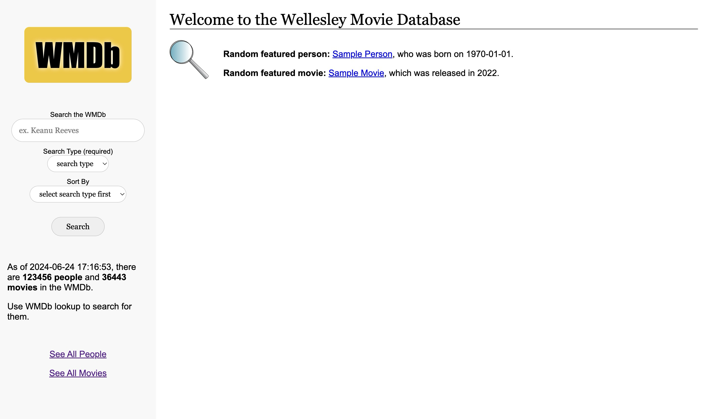

# WMDb Lookup

WMDb Lookup is a Flask-based web application that provides information about movies and people in the movie industry. This application is designed to demonstrate various web development skills, including using Flask, HTML templating with Jinja2, CSS for styling, MySQL database integration using Python queries, and handling static files.

Fulfills and goes beyond the requirements of the Lookup assignment for the Spring 2022 CS304 Databases with Web Interfaces course. 

## Features

- **Search Functionality**: Users can search for people (ie. directors, actors) and movies by name or title, respectively.

- **Sorting**: Multiple sorting options for search results.

- **Dynamic Content Rendering**: Displays search results dynamically based on user input.

- **Detailed Pages**: Provides detailed information pages for individual people and movies, including birthday and credits for people and release date and director(s) for movies.

- **Random Featured Entries**: Showcases random people and movies on the homepage.

- **Database Overview**: Informs the user of the current number of movies and the current number of people in the database.

- **Error Handling**: Custom error pages for not found results.

- **Static Files**: Serves CSS for styling and images for visual content.

## Skills Demonstrated

- Setting up a **Flask** application, routing, and handling requests.

- Integrating a **MySQL** database and performing queries using Python.

- Creating **HTML** templates and using **Jinja2** for dynamic content rendering, merged with data fetched from the backend.

- Styling the web pages with **CSS** and serving and managing static files in Flask.

- Handling and processing **GET requests** with parameters.

- Implementing forms to collect user input.

- Utilizing **Jinja2 template inheritance** to create a consistent look and feel across the site.



### Folder Structure

```plaintext
your_app/
├── app.py
├── templates/
│   ├── base.html
│   ├── movieList.html
│   ├── movieDetails.html
│   ├── notFound.html
│   ├── peopleList.html
│   └── personDetails.html
├── static/
│   ├── style.css
│   ├── magnifying_logo.png
│   └── base_screenshot.png
├── queries.py